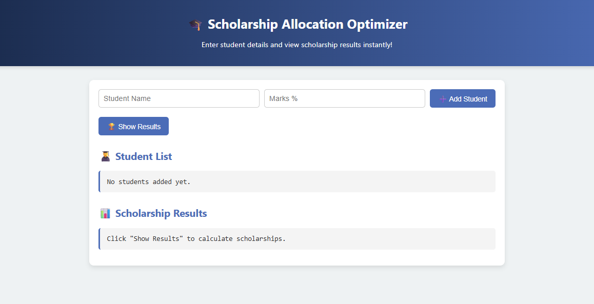
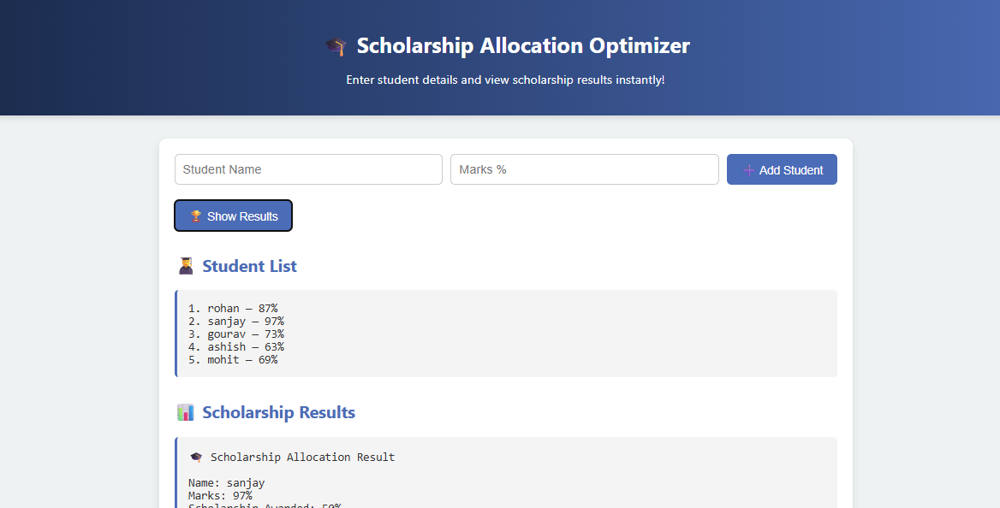
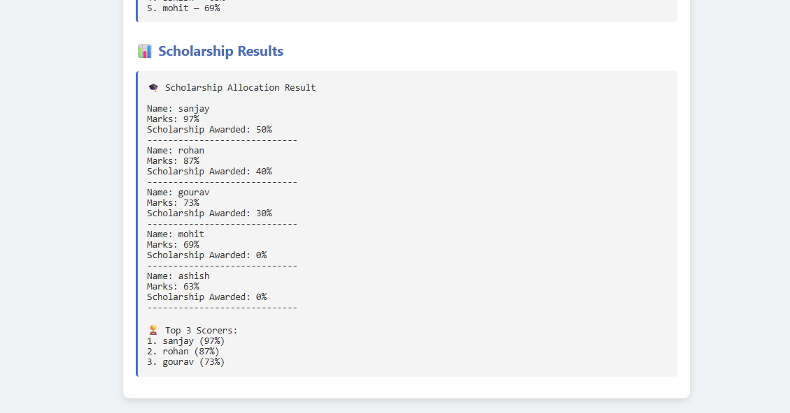

🎓 Scholarship Allocation Optimizer

A web-based tool to manage and optimize scholarship allocation based on student marks, built using **HTML**, **CSS**, and **JavaScript**.  
It helps universities automate scholarship distribution logic, similar to LPU NEST or internal entrance tests.

---

📸 Demo Screenshot
 > 
> 
> 
---

📌 Features

- 🧑‍🎓 Add student name and marks via web form  
- 📋 Auto-display of all entered students  
- 🧠 Calculates scholarship based on:
  - 90% and above → **50% Scholarship**
  - 80%–89% → **40%**
  - 70%–79% → **30%**
  - Below 70% → **No Scholarship**
- 🏆 Shows Top 3 Scorers  
- 💻 Purely browser-based — No server, No terminal needed

---

 🛠 Tech Stack

| Frontend  | Language |
|-----------|----------|
| HTML5     | ✔️        |
| CSS3      | ✔️        |
| JavaScript (ES6) | ✔️  |

> 🧠 DSA Concepts Used: Arrays, Sorting, Object Mapping, Conditional Logic
